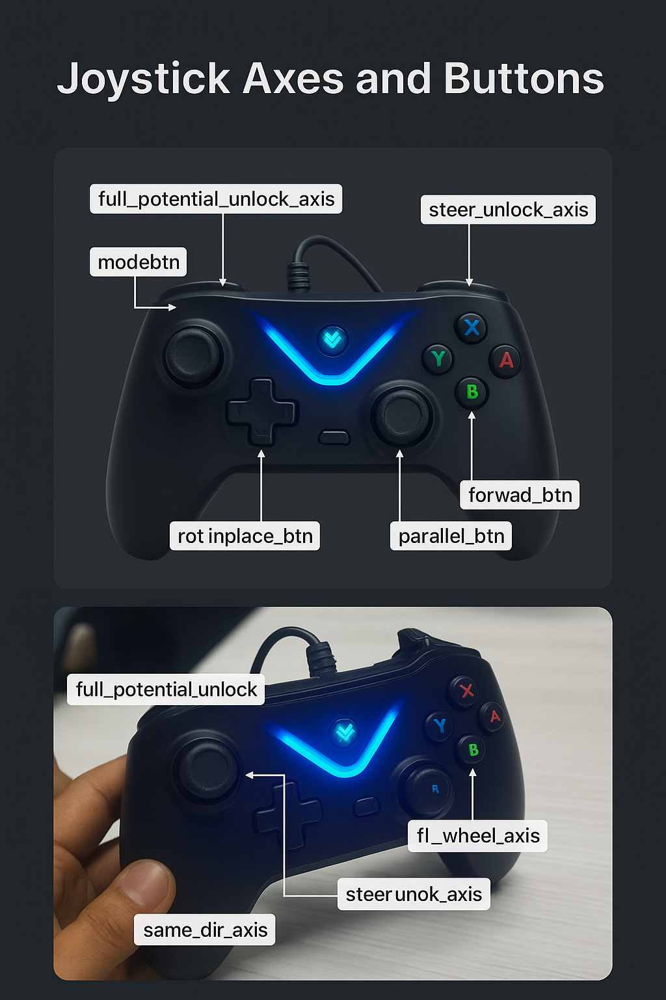

# FULL AUTO STEERING 

### shebang-->
ensure that the file operates in python 3

### imports statements -->
- ROS imports -> For node, topics and custom messages 
queue->For taking average of velocity and omega commands explained later 
copy->For making deep and shallow copy of lists 
operator.add->For element wise addition 

### Initialisation of class named as Drive ->
- self.init_dir-> An list initialised by 1 which can be changed to -1 if that wheel is required to move in opposite direction 
- self.max_steer_pwm->A maximum pwm value is set which is later utilised in pid controller in steer function 
- An node named as drive arc is created 

### Subscriptions -->
- this node is subscribing to the topics joy,enc_auto(This is required for manual mode )
- Further it also subscribes to /motion and rot (For autonomous motion )

### Publishers -->
- The node is publsihing to motor_pwm and state 
- Here state is a boolean value which is 0 for manual mode and 1 for autonomous mode 

### INT32MultiArray
- INT32MultiArray is a message type which consists of data as well as a layout 
- layout basically takes care of the format of the array of data including the label,data offset and size and stride.
- Layout is not considered necessary but its advised to use it 

### joy data format-->
It returns two arrays 
1-buttons is a int array which consisits of either 0 or 1
2-axes is a float array which consists of values ranging from -1 to +1

Initialisations and designation of various buttons and axes to their rrespective indexes -->
here the button and axes are then designated to various indexes to be returned from the joy data 
like forward button is named as 4 which means its data can be read from 4 index of the buttons array of the message received from joy callback.(IF ITS 1 ,IT MEANS THAT THE BUTTON IS BEING PRESSED AND IF ITS 0 IT MEANS IT IS NOT BEING PRESSED )

There are two important modes which control the entire logic of the code 
one is steer_isLocked and the other is full_potential_isLocked 
Depending on whether botha ere true or which one of them is true or false the axes definition changes which can be seen later in the code 

Initially the state is initialised as False  for manual mode 
Moroever both the steering_isLocked and full_potential_isLocked are initailised to true and rotinplace is initialised as false

 # Joycallback --->>
- the modes available for the rover are 0,1,2,3,4.
- On pressing mode up button the mode rises by 1 and on pressing mode down button the mode decreases by 1 
- The higher the mode Higher is the speed of the rover 
- Dependiong on the steering isLocked and full_potential_isLocked states the axes definition changes -

## Joystick Axes and Buttons

*Joystick layout showing all mapped axes and buttons for rover control.*

## Joystick Axes and Buttons Mapping

| Label in Image              | Code Variable / Axis/Button Name    | Function / Usage in Code                | Typical Joystick Location       |
|-----------------------------|-------------------------------------|-----------------------------------------|---------------------------------|
| `modeupbtn`                 | `modeupbtn` (Button)                | Increase drive mode                     | Top, right shoulder (RB)        |
| `modednbtn`                 | `modednbtn` (Button)                | Decrease drive mode                     | Top, left shoulder (LB)         |
| `forward_btn`               | `forward_btn` (Button)              | All wheels forward steering             | Face button (e.g., Y or X)      |
| `parallel_btn`              | `parallel_btn` (Button)             | All wheels perpendicular steering       | Face button (e.g., B or A)      |
| `rotinplace_btn`            | `rotinplace_btn` (Button)           | Rotate-in-place steering                | Face button (e.g., X or Y)      |
| `steer_unlock_axis`         | `steer_unlock_axis` (Axis)          | Toggle steering unlock mode             | Trigger or bumper (analog axis) |
| `full_potential_unlock_axis`| `full_potential_unlock_axis` (Axis) | Toggle individual wheel control mode    | Trigger or bumper (analog axis) |
| `fb_axis`                   | `fb_axis` (Axis)                    | Forward/Backward drive                  | Left stick vertical             |
| `lr_axis`                   | `lr_axis` (Axis)                    | Left/Right drive                        | Left stick horizontal           |
| `curve_opp_str`             | Axis 3                              | Curved steering (opposite direction)    | Right stick horizontal          |
| `steer_samedir_axis`        | `steer_samedir_axis` (Axis)         | All wheels steer same direction (PWM)   | Right stick vertical            |
| `steer_oppdir_axis`         | `steer_oppdir_axis` (Axis)          | Opposite direction steering (PWM)       | Right stick horizontal          |
| `fl_wheel_axis`             | `fl_wheel_axis` (Axis)              | Individual front-left wheel steering    | Custom mapped axis              |
| `fr_wheel_axis`             | `fr_wheel_axis` (Axis)              | Individual front-right wheel steering   | Custom mapped axis              |
| `bl_wheel_axis`             | `bl_wheel_axis` (Axis)              | Individual back-left wheel steering     | Custom mapped axis              |
| `br_wheel_axis`             | `br_wheel_axis` (Axis)              | Individual back-right wheel steering    | Custom mapped axis              |
| `autonomous_btn`            | `autonomous_btn` (Button)           | Toggle autonomous/manual mode           | Start/Menu/Guide button         |

> **Note:**  
> - "Custom mapped axis" means you may need to check your joystick configuration or code for the exact axis number.
> - The actual button/axis numbers may vary depending on your joystick model and ROS setup. Always verify with your device.

## Steering and Drive Modes

| Mode # | `steer_islocked` | `full_potential_islocked` | Mode Name           | Joystick Controls Used                                                                                                    | Control Variables Initialized                                                                                                 | Description                                                                                                    |
|--------|------------------|--------------------------|---------------------|--------------------------------------------------------------------------------------------------------------------------|------------------------------------------------------------------------------------------------------------------------------|----------------------------------------------------------------------------------------------------------------|
| 1      | True             | True                     | Locked Steering     | Buttons: `forward_btn`, `parallel_btn`, `rotinplace_btn`   Axes: `fb_axis`, `lr_axis`, axis 3                         | `steering_ctrl_locked = [forward_btn, parallel_btn, rotinplace_btn]`   `drive_ctrl = [fb_axis, -lr_axis]`   `curve_opp_str = axis 3` | Normal driving mode. Steering is preset (all wheels together), drive is via joystick axes.                  |
| 2      | False            | True                     | Unlocked Steering   | Buttons: `forward_btn`, `parallel_btn`   Axes: `steer_samedir_axis`, `steer_oppdir_axis`                              | `steering_ctrl_unlocked = [forward_btn, parallel_btn]`   `steering_ctrl_pwm = [steer_samedir_axis, steer_oppdir_axis]`    | Advanced steering mode. Operator can steer all wheels together or in opposite directions using joystick.     |
| 3      | True             | False                    | Individual Steering | Axes: `fl_wheel_axis`, `fr_wheel_axis`, `bl_wheel_axis`, `br_wheel_axis`                                                 | `full_potential_pwm = [fl_wheel_axis, fr_wheel_axis, bl_wheel_axis, br_wheel_axis]`                                          | Individual wheel steering. Operator can control each wheel’s steering angle separately.                      |
| 4      | False            | False                    | (Unused/Invalid)    | —                                                                                                                        | —                                                                                                                            | This mode is not entered by design.                                                                            |

## Control Variables Summary

| Variable Name             | Used In Mode(s)         | Description                                                                                  |
|--------------------------|-------------------------|----------------------------------------------------------------------------------------------|
| `steering_ctrl_locked`   | 1 (Locked Steering)     | `[forward_btn, parallel_btn, rotinplace_btn]` — preset steering actions via buttons          |
| `drive_ctrl`             | 1 (Locked Steering)     | `[fb_axis, -lr_axis]` — forward/back and left/right drive via axes                          |
| `curve_opp_str`          | 1 (Locked Steering)     | `axis 3` — for curving with steering                                                        |
| `steering_ctrl_unlocked` | 2 (Unlocked Steering)   | `[forward_btn, parallel_btn]` — for relative 45-degree or other advanced steering functions |
| `steering_ctrl_pwm`      | 2 (Unlocked Steering)   | `[steer_samedir_axis, steer_oppdir_axis]` — for PWM-based steering control                  |
| `full_potential_pwm`     | 3 (Individual Steering) | `[fl_wheel_axis, fr_wheel_axis, bl_wheel_axis, br_wheel_axis]` — individual wheel steering  |

## Switching the modes 
- If the steer unlock axis is pressed to -1 then the steer_isLocked becomes False
- If the full_potential_unlock is pressed to -1 then the full_potential_isLocked becomes False 
- If autonomous button is pressed then the state changes to True 

# Steering function 
It basically responds to the button or the axis pressed

## For both the modes true
- If front button is pressed then the four wheels get aligned along the rover 
- If the parallel button is pressed then the four wheels get aligned perpendicular to the rover 
- If the rotin place button is pressed then the two wheels get aligned at 55 degree and the two wheels get aligned at -55 with respect to the rover 
- If the cuve_poosite_str is crossing 0.2 then the rover will take a curve and for that wheels will have a velocity as well as a omega 

## Steer unlocked-False and full_potential-True
- If forward button is pressed then all the wheels roatate 45 degree clockwise relative to the initial angle 
- If parallel button is pressed then all the wheels rotate 45 degree anticlockwise relative to the intitial angle
- If the same direction axis is pressed then all the wheels get a pwm value  in the same direction 
- If the  opposite direction axis is pressed then all the wheels get a pwm value  in the opposite  direction

##   Steer unlocked-True and full_potential-False
In this mode every wheel is rotated independent of the others 
depending on the button differebnt wheels can be rotated independently 

## Drive Function Overview

The `drive(self)` method is responsible for generating and publishing the drive PWM commands for all four wheels of the rover. It works in both manual (joystick) and autonomous modes, supporting both normal and rotation-in-place driving.

### Logic Flow

1. **Drive is only active when:**
   - Steering is complete (`steering_complete == True`)
   - Steering is locked (`steer_islocked == True`)
   - Full potential (individual wheel) mode is locked (`full_potential_islocked == True`)

2. **Modes:**
   - **Rotation-in-place:**  
     - Triggered by a special joystick button (`rotinplace == True`)
     - Uses only the left/right axis to spin the rover around its center.
     - PWM values for left/right wheels are set in opposite directions.
   - **Normal drive:**  
     - Uses joystick axes for forward/backward and left/right movement.
     - Smooths velocity and omega (rotation) using a queue/average filter.
     - Computes PWM for each wheel based on the sum/difference of velocity and omega.

3. **Autonomous Mode:**
   - If `state == True`, velocity and omega are set by the autonomous system instead of the joystick.

4. **PWM Message Structure:**
   - `self.pwm_msg.data = [fl_dr, fr_dr, bl_dr, br_dr, fl_str, fr_str, bl_str, br_str]`
   - Only the first four values (drive) are set in this function; steering values are handled elsewhere.

5. **Debug Output:**
   - Prints velocity, omega, and mode for debugging at a reduced frequency.

## Steering Control Function (`steer`)

The `steer(self, initial_angles, final_angles, mode)` function is responsible for rotating the steering motors of all four wheels to desired angles using closed-loop feedback from encoders.

### How It Works

- **Inputs:**
  - `initial_angles`: List of starting encoder angles for each wheel.
  - `final_angles`: List of target angles (relative or absolute, depending on mode).
  - `mode`:  
    - `0` = Relative mode (move each wheel by a specified offset from its current position)
    - `1` = Absolute mode (move each wheel to a specified absolute angle)

- **Process:**
  - For each wheel, the function calculates the error between the current encoder reading and the target angle.
  - It applies a proportional controller (`kp_steer`) to compute the PWM signal needed to reduce the error.
  - The PWM command is capped at `max_steer_pwm` to avoid overdriving the motors.
  - The process repeats in a loop, updating the PWM commands and publishing them at 10 Hz, until all wheels are within a small error threshold (`error_thresh`) of their targets or a timeout occurs.

### Modes Explained

- **Relative Mode (`mode == 0`):**
  - Each wheel is commanded to move by a certain angle relative to where it started.
  - Example: If `final_angles = [45, 45, 45, 45]`, each wheel will try to rotate +45° from its initial position.

- **Absolute Mode (`mode == 1`):**
  - Each wheel is commanded to reach a specific absolute angle.
  - Example: If `final_angles = [0, 90, 0, 90]`, wheels will move to those exact angles.

